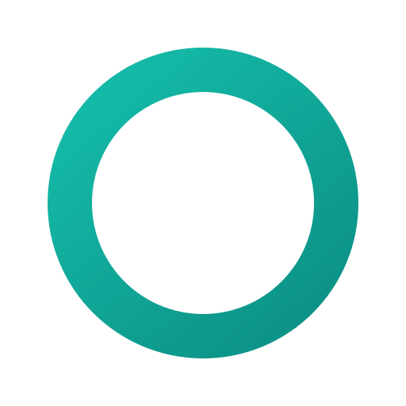

<p align="center">
  
</p>

<h1 align="center">Owen</h1>

<p align="center">
  Privacy-first mobile chat client for AI models — Android / Flutter.<br>
  Connect with <b>your own API keys</b> to any OpenAI-compatible endpoint.
  Nothing passes through any intermediate server.
</p>
<p align="center">
  <a href="https://github.com/autoselff/owen_app/releases/download/1.0.0/app-release.apk">DOWNLOAD</a>
</p>

---

## Why Owen

Most AI chat apps route your messages through their own backend. Owen doesn't:
it talks **directly** to the provider you configure, stores everything **locally
and encrypted**, and ships **zero telemetry**. Your keys and your history never
leave the device except as requests to the endpoint you chose.

## Screenshots
<p align="center">
  
  
</p>

## Privacy & security

- **No telemetry or analytics.** The only network traffic goes to the endpoints
  you configure yourself.
- **API keys** live exclusively in the system keystore (Android Keystore) via
  `flutter_secure_storage` — never in the database or app files.
- **Conversation history** sits in a local **SQLCipher-encrypted database**; the
  DB key is a random 256-bit CSPRNG value, also kept only in the keystore.
- **Screenshots blocked** (`FLAG_SECURE`): the content can't be captured or
  screen-recorded, and is hidden in the app switcher and on untrusted displays.
- **App lock** (optional): require biometrics or the device PIN to open Owen;
  it re-locks whenever the app is backgrounded.
- **No device backups.** `allowBackup=false` plus data-extraction rules exclude
  the app from Android cloud backup and device-to-device transfer.
- **"Delete all data"** removes every provider, key, and message from the device.

## Features

- **Streaming responses** (SSE, token by token).
- **Local multi-conversation history**, with **rename** (tap the title, or ⋮ in
  the list) and delete.
- **Per-conversation** provider and model selection + custom system prompt.
- **Compress conversation** — distils a long chat into a compact context brief
  and forks a fresh, cheaper conversation that carries it in its system prompt,
  cutting the input tokens re-sent on every turn. The original is kept intact.
- **Markdown, code blocks, and LaTeX** rendering (`gpt_markdown`); copy replies.
- **Material You** dynamic colour on supported devices, light/dark.

## Supported providers

A single universal adapter for the OpenAI `/chat/completions` format (with
streaming), so it works with **DeepSeek**, OpenAI, OpenRouter, Groq, Mistral,
Together — as well as locally-run **Ollama** and **LM Studio** (the strongest
privacy option: nothing leaves your own hardware). Ready-made presets are in the
add-provider screen; any other endpoint can be added manually
(Base URL + key + model list).

DeepSeek example:
- Base URL: `https://api.deepseek.com/v1`
- Models: `deepseek-chat`, `deepseek-reasoner`

## Architecture

```
lib/
  core/theme.dart                  Material 3 theme (light/dark)
  data/
    models/                        ProviderProfile, Conversation, ChatMessage
    secure/secret_store.dart       API keys + DB key → keystore
    db/app_database.dart           SQLCipher store (sqflite_sqlcipher)
    llm/openai_client.dart         streaming /chat/completions client
  state/
    app_providers.dart             Riverpod: providers, conversations, settings
    chat_controller.dart           open chat: send, stream, compress-and-fork
    lock_providers.dart            app-lock preference + lock state
  features/
    conversations/                 conversation list + rename dialog
    chat/                          chat screen, composer, message bubbles
    lock/                          LockGate + biometric lock screen
    settings/                      providers + endpoint/key editing
```

State management is **Riverpod 3**. The database and keystore are initialized in
`main()` and injected via `ProviderScope.overrides`, so the rest of the app
depends on interfaces, not globals.

## Running

```bash
flutter pub get
flutter run              # on a connected Android device / emulator
flutter analyze
flutter test
```

Requires a configured Android SDK (cmdline-tools + accepted licenses:
`flutter doctor --android-licenses`).

App icons are generated from the source art in `assets/logo/`:

```bash
dart run flutter_launcher_icons
```

## License

Owen is free software licensed under the **GNU General Public License v3.0**
(GPL-3.0). You may use, study, share, and modify it; any derivative work must
also be released under the GPL-3.0. See [`LICENSE`](LICENSE) for the full text.

Copyright (C) 2026 autoselff

---

> **Note on how this was built.** Owen was developed with the assistance of a
> large language model (LLM). Its code, comments, and this documentation were
> written collaboratively with AI, then reviewed before committing.
